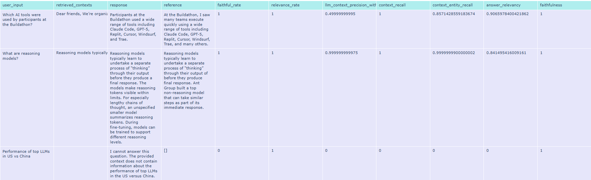

# Multi-Modal RAG System for AI Article Querying

A production-ready Retrieval-Augmented Generation (RAG) system that answers questions about AI topics by retrieving and synthesizing information from both **text content and images** from DeepLearning.AI articles.


---

## 🌟 Key Features

- **Multi-Modal Retrieval**: Queries both article text and image descriptions simultaneously
- **Vision-Language Processing**: Converts charts, graphs, and diagrams into searchable text using Gemini 2.0 Flash Lite
- **Interactive UI**: Streamlit-based chat interface with source citations and image display
- **Production Ready**: Sub-2-second query latency, comprehensive error handling
- **Modular Pipeline**: Easy to extend and customize for other domains

---


## 🏗️ Architecture Overview

The system follows a modular pipeline architecture:


### Core Components:

1. **Data Ingestion** - Web scraping of articles with BeautifulSoup
2. **Image Processing** - Vision-language model generates detailed descriptions
3. **Data Integration** - Merges text and image data with metadata
4. **Vector Indexing** - Creates FAISS index with HuggingFace embeddings
5. **RAG Engine** - Retrieves relevant sources and generates answers
6. **User Interface** - Interactive Streamlit chat application
7. **Evaluation** - RAGAS-based quality assessment framework

---


## 🚀 Installation

### 1. Clone the Repository

```bash
git clone <repository-url>
cd multirag
```

### 2. Create Virtual Environment

```bash
# Windows
python -m venv venv
venv\Scripts\activate

# Linux/macOS
python3 -m venv venv
source venv/bin/activate
```

### 3. Install Dependencies

```bash
pip install -r requirements.txt
```

### 4. Set Up Environment Variables

Create a `.env` file in the project root:

```bash
cp .env.example .env
```

Edit `.env` and add your Google API key:

```
GOOGLE_API_KEY=your_google_api_key_here
```

---

## ⚡ Quick Start

### Option 1: Run Complete Pipeline

```bash
# Run all stages: scraping → image description → merging → indexing
python pipeline.py
```

**Expected Output**:
```
✓ STEP 1: Web Scraping completed
✓ STEP 2: Image Description Generation completed
✓ STEP 3: Data Merging completed
✓ STEP 4: Vector Store Indexing completed
✓ PIPELINE COMPLETED SUCCESSFULLY!
```

### Option 2: Run Individual Stages

```bash
# 1. Scrape articles from DeepLearning.AI
python ingest.py

# 2. Generate image descriptions using Gemini Vision
python img_desc_generation.py

# 3. Merge article text with image descriptions
python merging_data.py

# 4. Build FAISS vector index
python indexing.py
```

### Launch the Application

```bash
cd src
```
```bash
streamlit run streamlit_app.py
```

---

## ⚙️ Configuration

All settings are centralized in `config.py`:

### Key Configuration Options

```python
# Scraping Configuration
NUM_PAGES = 3              # Number of article listing pages to scrape
REQUEST_DELAY = 1.5        # Delay between requests (seconds)

# Image Description
MODEL_NAME = "gemini-2.0-flash-lite"  # Vision-language model
REQUEST_DELAY = 6.5        # Rate limiting for free tier (10 RPM)

# Embedding Configuration
EMBED_MODEL = "sentence-transformers/all-MiniLM-L12-v2"

# Chunking Strategy
TEXT_CHUNK_SIZE = 512      # Characters per text chunk
TEXT_CHUNK_OVERLAP = 128   # Overlap between chunks
IMAGE_CHUNK_SIZE = 128     # For long image descriptions
IMAGE_CHUNK_OVERLAP = 24

# RAG Configuration
LLM_MODEL = "gemini-2.0-flash"     # Answer generation model
TOP_K_ARTICLES = 5         # Number of articles to retrieve
TOP_K_IMAGES = 1          # Number of images to retrieve
RELEVANCE_THRESHOLD = 0.5  # Minimum similarity score
```

### Modifying Configuration

1. Edit values in `config.py`
2. Rerun the relevant pipeline stage
3. Restart the Streamlit app

**Example**: To retrieve more articles per query:
```python
# In config.py
TOP_K_ARTICLES = 10  # Changed from 5
```

---

## Pipeline Stages

### Stage 1: Web Scraping (`ingest.py`)

Extract articles from DeepLearning.AI "The Batch" newsletter

**Process**:
1. Scrapes listing pages for article metadata (title, URL, date)
2. Extracts article content (paragraphs, headings, lists)
3. Collects image URLs
4. Saves to `data/raw/articles.json`

---

### Stage 2: Image Description (`img_desc_generation.py`)

**Purpose**: Convert images into detailed textual descriptions

**Process**:
1. Downloads images from URLs
2. Sends to Gemini Vision API with structured prompt
3. Generates comprehensive descriptions (labels, numbers, colors, positions)
4. Saves incrementally to `data/processed/image_descriptions.json`


---

### Stage 3: Data Merging (`merging_data.py`)

**Purpose**: Combine article text with corresponding image descriptions

**Process**:
1. Loads raw articles and image descriptions
2. Matches images to articles by URL
3. Creates unified dataset with embedded image data
4. Saves to `data/processed/articles_with_image_descriptions.json`


---

### Stage 4: Vector Indexing (`indexing.py`)

**Purpose**: Create searchable vector embeddings

**Process**:
1. Loads merged articles
2. Splits text into chunks (512 tokens, 128 overlap)
3. Creates separate documents for image descriptions
4. Generates embeddings using HuggingFace model
5. Builds FAISS index
6. Saves to `vectorstore/` directory


### Stage 5: RAG Query (`MultRAG.py`)

**Purpose**: Answer user questions using retrieved sources

**Query Flow**:
1. **Embed query** using same model as indexing
2. **Parallel retrieval**:
   - Search articles (filter: `type=article_text`)
   - Search images (filter: `type=image_description`)
3. **Deduplication**: Merge duplicate articles by URL
4. **Context assembly**: Format articles + images into prompt
5. **LLM generation**: Gemini 2.0 Flash generates answer
6. **Structured response**: Returns answer + sources

---

## Model Selection Argumentation

### Vision-Language Model: Gemini 2.0 Flash Lite

**Why chosen**:
- State-of-the-art vision understanding for technical diagrams
- Free tier supports development (10 RPM)
- Fast inference (~1-2 seconds per image)


### Embedding Model: sentence-transformers/all-MiniLM-L12-v2

**Why chosen**:
- Fast CPU inference (~100 docs/second)
- Small model size (120MB)


---

### LLM: Gemini 2.0 Flash

**Why chosen**:
- Sub-second response times
- Excellent instruction following
- Free tier available


### Vector Store: FAISS

**Why chosen**:
- No server setup (local file-based)
- Pinecone/Weaviate (rejected: overkill for dataset size)


---

## 📊 Evaluation Results

Evaluation was conducted using the **RAGAS framework** on 3 test queries(because of free quota):

### Test Queries

1. "Which AI tools were used by participants at the Buildathon?"
2. "What are reasoning models?"
3. "Performance of top LLMs in US vs China"

### Overall Metrics


---

### Analysis

#### 1. Faithfulness

Faithfulness measures how accurately the generated answer reflects the information found in the retrieved context. A score of 1.0 means zero hallucinations — every statement in the answer can be traced directly to retrieved sources.


**Interpretation**:
- System only uses information from retrieved sources
- Refuses to answer when context is insufficient (Query 3)


#### 2. Relevance
Relevance measures whether the retrieved documents are semantically related to the user’s query. High scores indicate that the retriever consistently finds useful, on-topic documents.


**Interpretation**:
- Embedding model captures semantic similarity effectively
- No irrelevant "noise" documents in top-K retrieval

---

#### 3. Context Precision
Context Precision measures the proportion of retrieved content that is directly useful for answering the query. Lower scores mean that some retrieved text is only partially relevant or tangential

**Interpretation**:
- More tokens sent to LLM, but still produces correct answer
- Implement cross-encoder re-ranking 
- Use query expansion to generate multiple query variations


---

#### 4. Context Recall
Context Recall measures whether all necessary information to answer the query is retrieved at least once. High recall ensures that the model has full access to relevant facts.

**Interpretation**:
- Top-K setting 5 articles is sufficient
- High recall ensures comprehensive answers

---

#### 5. Context Entity Recall

Context Entity Recall evaluates how many of the key entities (e.g., names, organizations, products, models) mentioned in the ground-truth reference are present in the retrieved context.

**Interpretation**:
- High entity recall ensures factual completeness of retrieved evidence.
- Combine dense embeddings with BM25 (keyword-based retrieval)


---

#### 6. Answer Relevancy

Answer Relevancy measures how directly the generated answer addresses the user’s question, balancing completeness and conciseness.

**Interpretation**:
- The model maintains strong topical focus and high-quality response generation.
---


